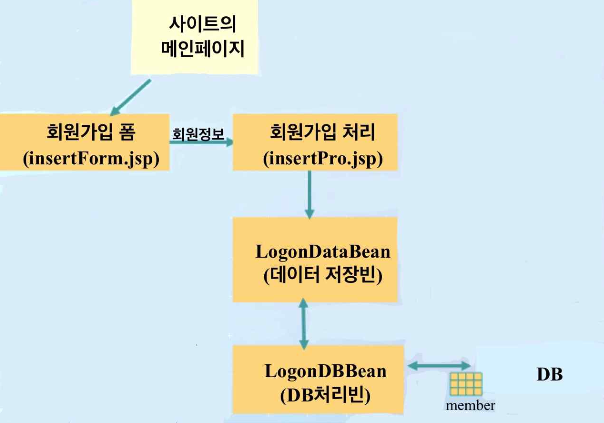
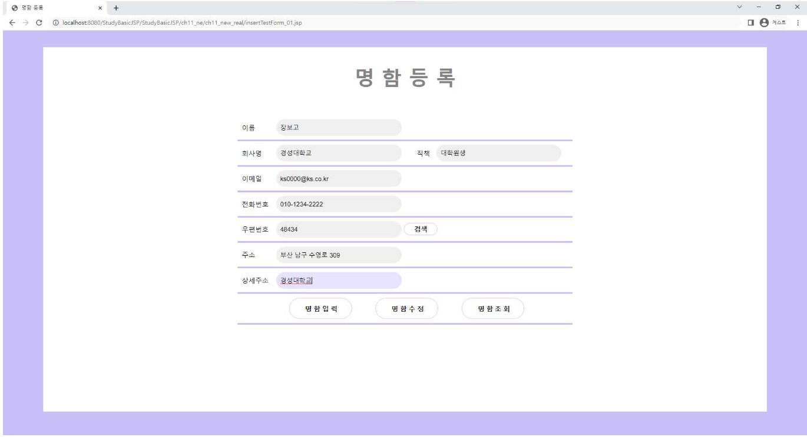
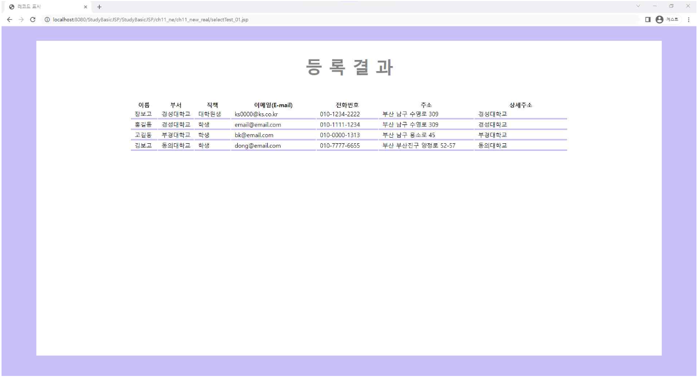
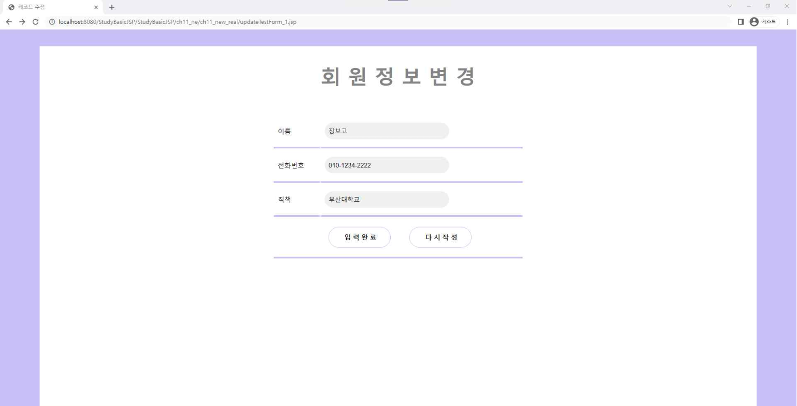
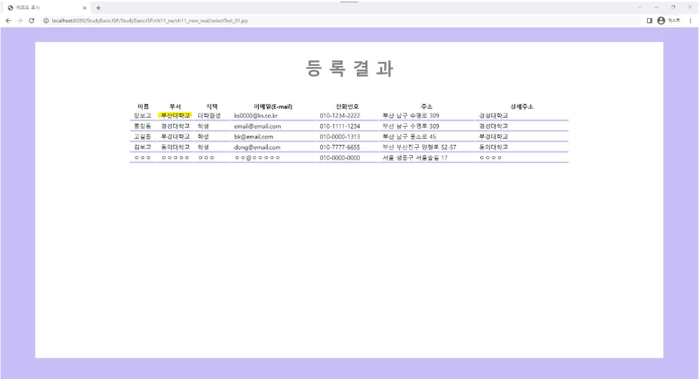
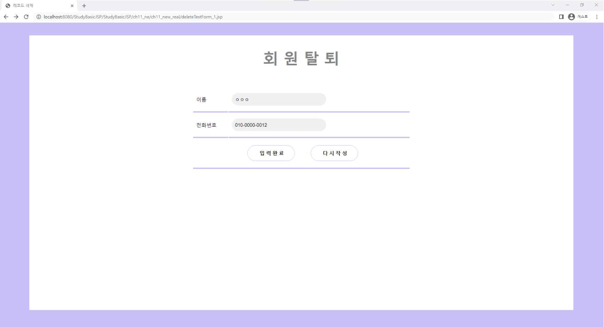
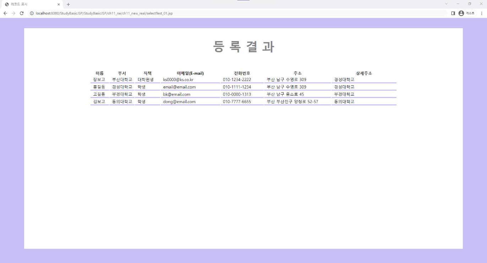

# JSP-MiniProject
사원 개인 카드 관리 - 웹프로그래밍과제
> 명함 DB연동 JSP / JAVA / DataBase

## 시스템 개요

1. DataBase
- ch11 DB sql 명령(Mysql Workbench).sql
- JDBC 프로그래밍 : JDBC 드라이브 로드 -> 데이터베이스 연결 -> Statement 생성 -> SQL 문 전송 -> 결과 받기

2. JSP
- InsertTestForm_01.jsp : 명함 등록 화면
- InsertTestPro_01.jsp : 테이블에 레코드를 삽입(추가)하는 JSP, 명함 등록 완료
- UpdateTestForm_01.jsp : 명함 수정 화면
- UpdateTestPro_01.jsp : 테이블에 저장되어 있는 레코드를 수정하는 JSP, 명함 수정 완료 
- DeleteTestForm_01.jsp : 명함 삭제 화면
- DeleteTestPro_01.jsp : 테이블에 저장되어 있는 레코드를 삭제하는 JSP, 명함 삭제 완료 
- SelectTestPro_01.jsp : 테이블에 저장되어 있는 레코드를 검색(조회)하는 JSP, 테이블 목록 
- usePool_01.jsp : 커넥션풀로부터 커넥션 사용하여 테이블에 저장되어 있는 레코드를 조회하는 JSP

3.  Java
- RegisterBean.java : 명함등록을 전달할 자바빈
    - 과제 1에서 제작한 명함 입력폼을 이용하여 입력된 명함을 관리하는 DB를 생성합니다.

4. 모바일웹기능구현
- inkTestForm.jsp : 모바일 웹 명함 등록 화면 
- linkTestProc.jsp : 모바일 웹 명함 처리 JSP

## 실행 결과
1. 회원 등록

|등록|등록결과|
|----|----|
|||

2. 회원 수정

|수정|수정결과|
|----|----|
|||

2. 회원 삭제

|삭제|삭제결과|
|----|----|
|||

